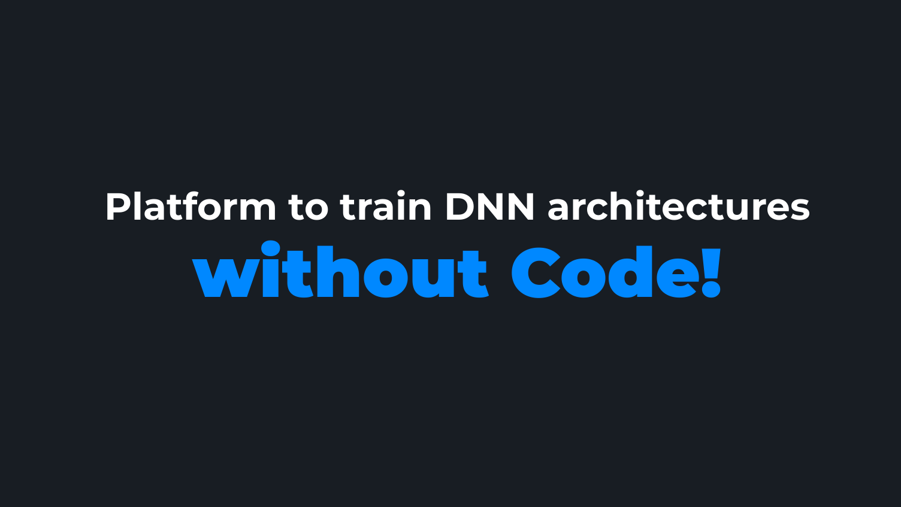

# TrafficSignRecognition

This project was generated with [Angular CLI](https://github.com/angular/angular-cli) version 9.1.1.

## Read the flow of code [here](./FlowReadme.txt)

## Installation Steps

### Installing Node
We need Node v14.5.0. To install it, follow the installation instructions [here](https://www.digitalocean.com/community/tutorials/how-to-install-node-js-on-ubuntu-18-04). Make sure you use **14.x** instead of **10.x**

### Installing Angular  
`npm install -g @angular/cli` to install angular CLI.

### Install project dependencies
Navigate to *traffic-sign-recognition* directory and run `npm install`. This will install required dependencies specific to the project.

### Install Python dependencies
Navigate to *traffic-sign-recognition/backend* folder and run `pip install -r requirements.txt`

## Running Project
### Running Backend
* Navigate to *traffic-sign-recognition/backend* and run `python3 manage.py migrate`.
* Run `python3 manage.py runserver`
* Proceed to running frontend

### Running Frontend
* Navigate to *traffic-sign-recognition* directory and run `ng serve`
* Navigate  to `localhost:4200` on your browser to view the webpage.

## Further steps:

### Development server

Run `ng serve` for a dev server. Navigate to `http://localhost:4200/`. The app will automatically reload if you change any of the source files.

### Code scaffolding

Run `ng generate component component-name` to generate a new component. You can also use `ng generate directive|pipe|service|class|guard|interface|enum|module`.

### Build

Run `ng build` to build the project. The build artifacts will be stored in the `dist/` directory. Use the `--prod` flag for a production build.

### Running unit tests

Run `ng test` to execute the unit tests via [Karma](https://karma-runner.github.io).

### Running end-to-end tests

Run `ng e2e` to execute the end-to-end tests via [Protractor](http://www.protractortest.org/).

### Further help

To get more help on the Angular CLI use `ng help` or go check out the [Angular CLI README](https://github.com/angular/angular-cli/blob/master/README.md).

## Downloading the training dataset (GTSRB):

Download the dataset from the official site [INI](https://benchmark.ini.rub.de/gtsrb_dataset.html) and convert all .ppm images to .png images

Else, download the dataset from here: [Kaggle link](https://www.kaggle.com/meowmeowmeowmeowmeow/gtsrb-german-traffic-sign) (already converted to .png)

Place the downloaded dataset in `backend/Data/Train` folder

## View the presentation here:
[PDF Presentation](./H1_BSC_9_Presentation_final.pdf)

## View the website demo video here:

